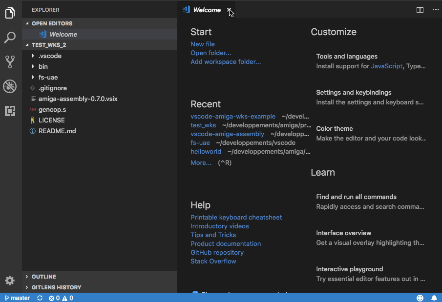

# Example project for Amiga assembly debugging
Example of vscode workspace for Amiga Assembly building and debugging.
The binaries are build for Osx.

## Get the files
- Clone this repository
- Get the binaries from the github [releases](https://github.com/prb28/vscode-amiga-wks-example/releases)
## Setup VSCode
- Install the 0.7.0 Amiga Assembly vscode extension from the vsix file
- Launch VSCode
- type F1 and select the option "Extension: Install from VSIX..."
- For linux and windows : Rename and replace the default config files the .vscode/settgins-xxxx.json and .vscode/launch-xxx.json
- Check the paths in these files
## Build the assembly file
- Open the 'gencode.s' file
## Debug the application
- Add a breakpoint to the file
- Type F5 to start debugging

## Build for Windows of Linux
- Build [VASM](http://sun.hasenbraten.de/vasm/index.php?view=main)
- Build [VLINK](http://sun.hasenbraten.de/vlink/index.php?view=main)
- Build a modified version of [Fs-UAE](https://github.com/prb28/fs-uae)
- Download/Build [CAPSTONE](http://www.capstone-engine.org/download.html)
- Modify the settings and the launch configuration to this new binaries

## Commands
### Memory dump
See the DEBUG console for the commands help.
