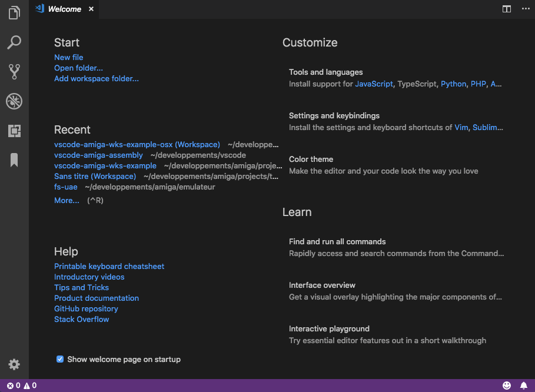

# Example project for Amiga assembly debugging
Example of vscode workspace for Amiga Assembly building and debugging.
The binaries are build for Osx.

## Get the files
- Download the latest [Example workspace bundle](https://github.com/prb28/vscode-amiga-wks-example/releases) according to your OS.

## Setup VSCode
- Launch VSCode and install the *Amiga Assembly Extension* extension

## Debug the application
- Open the workspace **File/Open Workspace...** -> Select the workspace file.
- **Select the debug launch configuration** and press *start*

## Documentation
- [Wiki](https://github.com/prb28/vscode-amiga-assembly/wiki)

